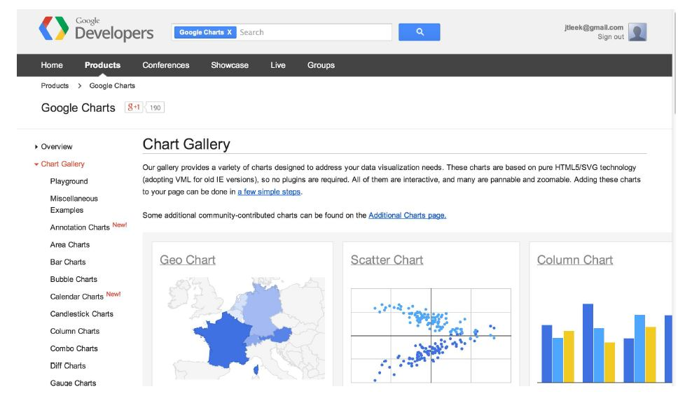
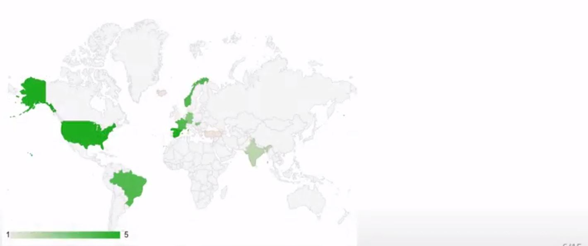
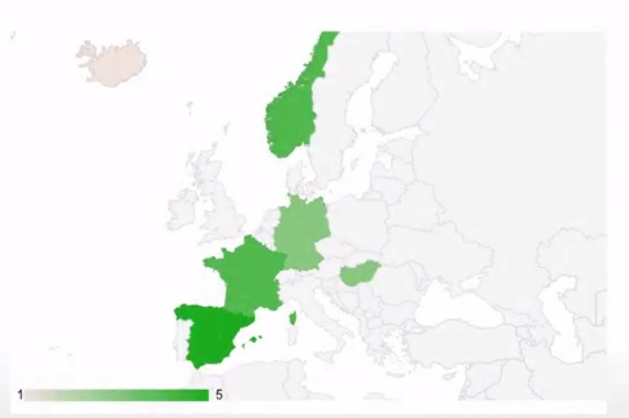
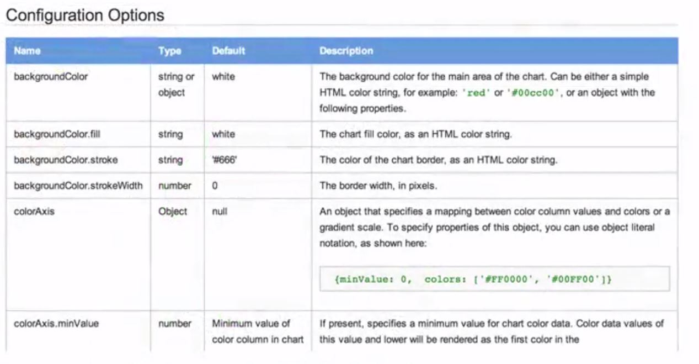
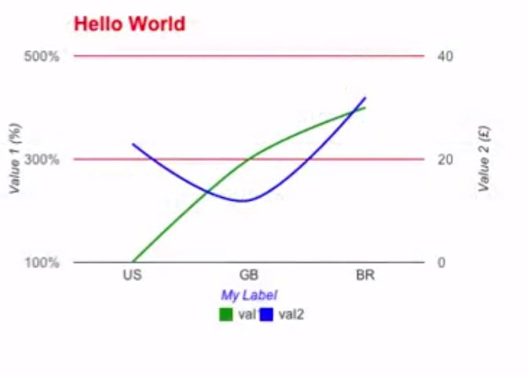
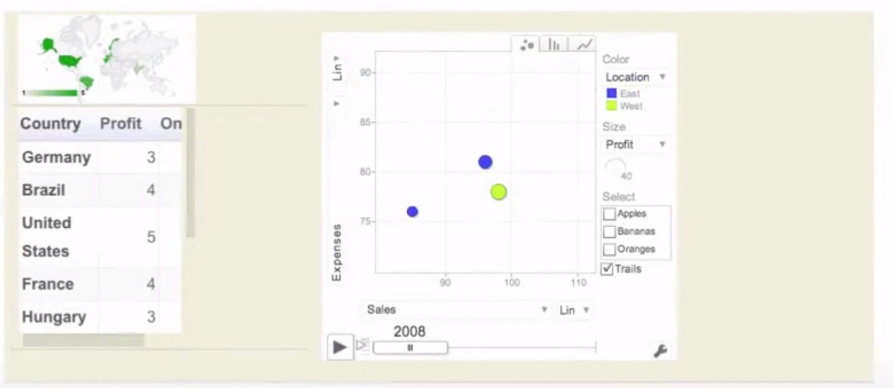

```{r setup, cache=FALSE, echo=FALSE, message=F, warning=F, tidy=FALSE}
require(knitr)
require(googleVis)
options(width=100)
opts_chunk$set(message=F, error=F, warning=F, comment=NA, fig.align='center', dpi=100, tidy=F, cache.path='.cache/', fig.path='fig/')

options(xtable.type='html')
knit_hooks$set(inline=function(x) {
    if(is.numeric(x)) {
        round(x, getOptions('digits'))
    } else {
        paste(as.character(x), collapse=', ')
    }
})
knit_hooks$set(plot=knitr:::hook_plot_html)
```

## Google Vis API



[https://developers.google.com/chart/interactive/docs/gallery](https://developers.google.com/chart/interactive/docs/gallery)

---

## Basic Idea

- The R function creates an HTML page
- The HTML page calls Google Charts
- The result is an interactive HTML graphic

---

## Example

```{r, eval=FALSE}
suppressPackageStartupMessages(library(googleVis))
M <- gvisMotionChart(Fruits, "Fruit", "Year",
                     options=list(width=600, height=400))
print(M, "chart")
```

---

## Charts in `googleVis`

#### "gvis + ChartType"

- Motion charts: `gvisMotionChart`
- Interactive maps: `gvisGeoChart`
- Interactive tables: `gvisTable`
- Line charts: `gvisLineChart`
- Bar charts: `gvisColumnChart`
- Tree maps: `gvisTreeMap`

[http://cran.r-project.org/web/packages/googleVis/googleVis.pdf](http://cran.r-project.org/web/packages/googleVis/googleVis.pdf)

---

## Plots on Maps

```{r, eval=FALSE}
G <- gvisGeoChart(Exports, locationvar="Country", colorvar="Profit",
                  options=list(width=600, height=400))
print(G, "chart")
```



---

## Specifying a Region

```{r, eval=FALSE}
G2 <- gvisGeoChart(Exports, locationvar="Country", colorvar="Profit",
                   options=list(width=600, height=400, region="150"))
print(G2, "chart")
```



---

## Finding Parameters to Set Under `options`



[https://developers.google.com/chart/interactive/docs/gallery/geochart](https://developers.google.com/chart/interactive/docs/gallery/geochart)

---

## Setting More Options

```{r, eval=FALSE}
df <- data.frame(label=c("US","GB","BR"), val1=c(1,3,4), val2=c(23,12,32))
Line <- gvisLineChart(df, xvar="label", yvar=c("val1","val2"),
                      options=ist(title="Hellow World!" etc))
```

[https://github.com/mages/Introduction_to_googleVis/blob/gh-pages/index.Rmd](https://github.com/mages/Introduction_to_googleVis/blob/gh-pages/index.Rmd)

---

## Setting More Options

```{r, eval=FALSE}
print(Line, "chart")
```



---

## Combining Multiple Plots Together

```{r, eval=FALSE}
G <- gvisGeoChart(Exports, "Country", "Profit",
                  options=list(width=200, height=100))
T1 <- gvisTable(Exports, options=list(width=200, height=270))
M <- gvisMotionChart(Fruits, "Fruit", "Year",
                     options=list(width=400, height=370))
GT <- gvisMerge(G, T1, horizontal=F)
GTM <- gvisMerge(GT, M, horizontal=T, tableOptions="bgcolor=\"#CCCCCC\" cellspacing=10")
```

---

## Combining Multiple Plots Together

```{r, eval=FALSE}
print(GTM, "chart")
```



---

## Seeing the HTML Code

```{r}
library(googleVis)
M <- gvisMotionChart(Fruits, "Fruit", "Year",
                     options=list(width=600, height=400))
print(M)
```

---

## Things You Can Do with `googleVis`

- The visualizations can be embedded in websites with HTML code
- Dynamic visualizations can be built with `shiny`, `rook`, and `R.rsp`
- Embed them in R markdown based documents
    - Set `results='asis'` in the chunk options
    - Can be used with `knitr` and `slidify`
    
---

## For More Info

```{r, eval=FALSE}
demo(googleVis)
```

- [http://cran.r-project.org/web/packages/googleVis/vignettes/googleVis.pdf](http://cran.r-project.org/web/packages/googleVis/vignettes/googleVis.pdf)
- [http://cran.r-project.org/web/packages/googleVis/googleVis.pdf](http://cran.r-project.org/web/packages/googleVis/googleVis.pdf)
- [https://developers.google.com/chart/interactive/docs/gallery](https://developers.google.com/chart/interactive/docs/gallery)
- [https://developers.google.com/chart/interactive/faq](https://developers.google.com/chart/interactive/faq)