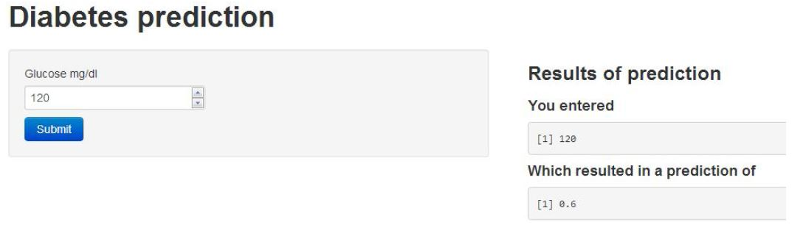

# Shiny


## What is `shiny`?

- `shiny` is a platform for creating interactive R programs embedded into a webpage
- Suppose that you create a prediction algorithm, with `shiny` you can _very easily_ create web input form that calls R and thus your prediction algorithm and displays the results
- Using `shiny`, the time to create simple, yet powerful, web-based interactive data products in R is minimized
    - However, it lacks the flexibility of full-featured (and more complex) solutions
- `shiny` is made by the fine folks at RStudio

---

## Some Mild Prerequisites

- `shiny` doesn't really require it, but as with all web programming, a little knowledge of html, css, and js is very helpful
    - html gives a web page structure and sectioning as well as markup instructions
    - css gives the style
    - js for interactivity
- There are too many tutorials online to count for getting basic proficiency in these topics
- `shiny` uses [boostrap](http://getbootstrap.com/) (no relation to the statistics bootstrap) style, which (to me) seems to look nice and renders well on mobile platforms

---

## What Else Is Out There?

- Creating any solutions requires fairly deep knowledge of web client/server programming
- [OpenCPU](https://www.opencpu.org/) by Jerome Ooms, is a really neat project providing an API for calling R from web documents
    - And he even hopses an OpenCPU server, but you can create your own
    
---

## Context

- You created a novel prediction algorithm to predict risk for developing diabetes
    - You're hoping patients and caregivers will be able to enter their data and, if needed, take preventative measures
- You want to create a website so that users can input the relevant predictors and obtain their prediction
- Your prediction algorithm (ok, so you're not going to be saving the world with this one)
    - [link for a real prediction score](http://www.ncbi.nlm.nih.gov/pubmed/12610029)


```r
diabetesRisk <- function(glucose) glucose/200
```

---

## Getting Started

- Make sure you have the latest release of R installed
- If on windows, make sure that you have Rtools installed
- `install.packages("shiny")`
- `library(shiny)`
- Great tutorial at [http://rstudio.github.io/shiny/tutorial/](http://rstudio.github.io/shiny/tutorial/)
- Basically, this lecture is walking through that tutorial offering some of our insights
- Note, some of the proposed interactive plotting uses of `shiny` could be handled by the very simple `manipulate` function [rstudio manipulate](https://support.rstudio.com/hc/en-us/articles/200551906-Interactive-Plotting-with-Manipulate)
- Also, `rCharts` will be covered in a different lecture

---

## A `shiny` Project

- A `shiny` project is a directory containing at least two parts
    - One named `ui.R` (for user interface) -- controls how it looks
    - One named `server.R` -- controls what it does

---

## `ui.R`


```r
library(shiny)
shinyUI(pageWithSidebar(
    headerPanel("Data science FTW!"),
    sidebarPanel(
        h3('Sidebar text')
    ),
    mainPanel(
        h3('Main Panel text')
    )
))
```

---

## `server.R`


```r
library(shiny)
shinyServer(
    function(input, output) {
    }
)
```

---

## To Run It

- In R, change to the directories with these files and type `runApp()`
- or put the path to the directory as an argument
- It should open in a browser window with the app running

---


---

## R functions for HTML markup

`ui.R`


```r
shinyUI(pageWithSidebar(
    headerPanel("Illustrating markup"),
    sidebarPanel(
        h1('Sidebar panel'),
        h1('H1 text'),
        h2('H2 text'),
        h3('H3 text'),
        h4('H4 text'),
    ),
    mainPanel(
        h3('Main Panel text'),
        code('some code'),
        p('some ordinary text')
    )
))
```

---


---

## Illustrating Inputs `ui.R`


```r
shinyUI(pageWithSidebar(
    headerPanel("Illustrating Inputs"),
    sidebarPanel(
        numericInput('id1', 'Numeric input, labeled id1', 0, min=0, max=10, step=1),
        checkboxGroupInput("id2", "Checkbox",
                           c("Value 1" = "1",
                             "Value 2" = "2",
                             "Value 3" = "3")),
        dateInput("date", "Date:")
    ),
    mainPanel(
    )
))
```

---


---

## Part of `ui.R`


```r
mainPanel(
    h3('Illustrating outputs'),
    h4('You entered'),
    verbatimTextOutput("oid1"),
    h4('You entered'),
    verbatimTextOutput("oid2"),
    h4('You entered'),
    verbatimTextOutput("odate")
)
```

---

## `server.R`


```r
shinyServer(
    function(input, output) {
        output$oid1 <- renderPrint({input$id1})
        output$oid2 <- renderPrint({input$id2})
        output$odate <- renderPrint({input$date})
    }
)
```

---


---

## Let's Build Our Prediction Function

### `ui.R`


```r
shinyUI(
    pageWithSidebar(
        # Application title
        headerPanel("Diabetes prediction"),
        sidebarPanel(
            numericInput('glucose', 'Glucose mg/dl', 90, min=50, max=200, step=5),
            submitButton('Submit')
        ),
        mainPanel(
            h3('Results of prediction'),
            h4('You entered'),
            verbatimTextOutput("inputValue"),
            h4('Which resulted in a prediction of ')
            verbatimTextOutput("prediction")
        )
    )
)
```

### `server.R`


```r
diabetesRisk <- function(glucose) glucose / 200

shinyServer(
    function(input, output) {
        output$inputValue <- renderPrint({input$glucose})
        output$prediction <- renderPrint({diabetesRisk(input$glucose)})
    }
)
```

---

## The Result



---

## Image Example

- Let's build an example with an image
- How about we create a histogram of data
- Put a slider on so that the user has to guess the mean

---

## `ui.R`


```r
shinyUI(pageWithSidebar(
    headerPanel("Example plot"),
    sidebarPanel(
        sliderInput('mu', 'Guess at the mean', value=70, min=62, max=74, step=0.05)),
    mainPanel(
        plotOutput('newHist')
    )
))
```

---

## `server.R`


```r
library(UsingR)
data(galton)

shinyServer(
    function(input, output) {
        output$newHist <- renderPlot({
            hist(galton$child, xlab='child height', col='light blue', main='Histogram')
            mu <- input$mu
            lines(c(mu,mu), c(0,200), col="red", lwd=5)
            mse <- mean((galton$child - mu)^2)
            text(63, 150, paste("mu = ", mu))
            text(63, 140, paste("MSE = ", round(mse, 2)))
        })
    }
)
```

---

## The Output


---

## Tighter Control Over Style

- All of the style elements are handled through `ui.R`
- Instead, you can create a `www` directory and then an index.html file in that directory
    - [This link](https://rstudio.github.io/shiny/tutorial/#html-ui) goes through the html needed
    - You just have to have specific js libraries and appropriately named ids and classes. This is beyond the scope of this class
    - For students with a lot of experience in html, js, css it would be a breeze and probably easier and more flexible than the R html controls in `ui.R`
    
---

## Other Things `shiny` Can Do

- Allow users to upload or download files
- Have tabbed main panels
- Have editable data tables
- Have a dynamic UI
- User defined inputs and outputs
- Put a submit button so that Shiny only executes complex code after user hits submit

---

## Distributing a `shiny` App

- The quickest way is to send (or put on github or gist or dropbox or whatever) someone the app directory and they can call `runApp()`
- You could create an R package and create a wrapper that calls `runApp()`
    - Of course, these solutions only work if the user knows R
- Another option is to run a `shiny` server
    - Requires setting up a `shiny` [server](https://www.rstudio.com/products/shiny/shiny-server/)
    - Probably easiest if you use one of the virtual machines where they already have `shiny` servers running well, for example, on AWS
    - Setting up a `shiny` server is beyond the scope of this class as it involves some amount of linux server administration
    - Groups are creating `shiny` hosting services that will presumably eventually be a fee for service or freemium service
    - BTW, don't put system calls into your code (this is one of the first things many of us do for fun, but it introduces security concerns)
