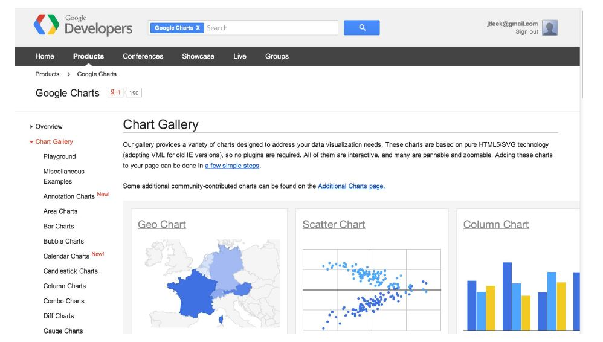
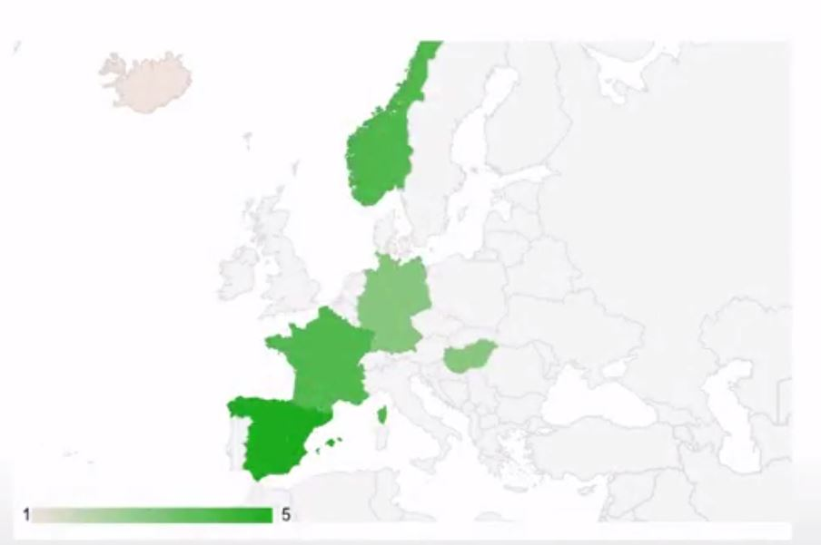

# GoogleVis


## Google Vis API



[https://developers.google.com/chart/interactive/docs/gallery](https://developers.google.com/chart/interactive/docs/gallery)

---

## Basic Idea

- The R function creates an HTML page
- The HTML page calls Google Charts
- The result is an interactive HTML graphic

---

## Example


```r
suppressPackageStartupMessages(library(googleVis))
M <- gvisMotionChart(Fruits, "Fruit", "Year",
                     options=list(width=600, height=400))
print(M, "chart")
```

---

## Charts in `googleVis`

#### "gvis + ChartType"

- Motion charts: `gvisMotionChart`
- Interactive maps: `gvisGeoChart`
- Interactive tables: `gvisTable`
- Line charts: `gvisLineChart`
- Bar charts: `gvisColumnChart`
- Tree maps: `gvisTreeMap`

[http://cran.r-project.org/web/packages/googleVis/googleVis.pdf](http://cran.r-project.org/web/packages/googleVis/googleVis.pdf)

---

## Plots on Maps


```r
G <- gvisGeoChart(Exports, locationvar="Country", colorvar="Profit",
                  options=list(width=600, height=400))
print(G, "chart")
```


---

## Specifying a Region


```r
G2 <- gvisGeoChart(Exports, locationvar="Country", colorvar="Profit",
                   options=list(width=600, height=400, region="150"))
print(G2, "chart")
```



---

## Finding Parameters to Set Under `options`


[https://developers.google.com/chart/interactive/docs/gallery/geochart](https://developers.google.com/chart/interactive/docs/gallery/geochart)

---

## Setting More Options


```r
df <- data.frame(label=c("US","GB","BR"), val1=c(1,3,4), val2=c(23,12,32))
Line <- gvisLineChart(df, xvar="label", yvar=c("val1","val2"),
                      options=ist(title="Hellow World!" etc))
```

[https://github.com/mages/Introduction_to_googleVis/blob/gh-pages/index.Rmd](https://github.com/mages/Introduction_to_googleVis/blob/gh-pages/index.Rmd)

---

## Setting More Options


```r
print(Line, "chart")
```


---

## Combining Multiple Plots Together


```r
G <- gvisGeoChart(Exports, "Country", "Profit",
                  options=list(width=200, height=100))
T1 <- gvisTable(Exports, options=list(width=200, height=270))
M <- gvisMotionChart(Fruits, "Fruit", "Year",
                     options=list(width=400, height=370))
GT <- gvisMerge(G, T1, horizontal=F)
GTM <- gvisMerge(GT, M, horizontal=T, tableOptions="bgcolor=\"#CCCCCC\" cellspacing=10")
```

---

## Combining Multiple Plots Together


```r
print(GTM, "chart")
```


---

## Seeing the HTML Code


```r
library(googleVis)
M <- gvisMotionChart(Fruits, "Fruit", "Year",
                     options=list(width=600, height=400))
print(M)
```

```
<!DOCTYPE html PUBLIC "-//W3C//DTD XHTML 1.0 Strict//EN"
  "http://www.w3.org/TR/xhtml1/DTD/xhtml1-strict.dtd">
<html xmlns="http://www.w3.org/1999/xhtml">
<head>
<title>MotionChartID8e485fb370a6</title>
<meta http-equiv="content-type" content="text/html;charset=utf-8" />
<style type="text/css">
body {
  color: #444444;
  font-family: Arial,Helvetica,sans-serif;
  font-size: 75%;
  }
  a {
  color: #4D87C7;
  text-decoration: none;
}
</style>
</head>
<body>
 <!-- MotionChart generated in R 3.1.2 by googleVis 0.5.10 package -->
<!-- Thu Oct 08 19:23:49 2015 -->


<!-- jsHeader -->
<script type="text/javascript">
 
// jsData 
function gvisDataMotionChartID8e485fb370a6 () {
var data = new google.visualization.DataTable();
var datajson =
[
 [
 "Apples",
2008,
"West",
98,
78,
20,
"2008-12-31" 
],
[
 "Apples",
2009,
"West",
111,
79,
32,
"2009-12-31" 
],
[
 "Apples",
2010,
"West",
89,
76,
13,
"2010-12-31" 
],
[
 "Oranges",
2008,
"East",
96,
81,
15,
"2008-12-31" 
],
[
 "Bananas",
2008,
"East",
85,
76,
9,
"2008-12-31" 
],
[
 "Oranges",
2009,
"East",
93,
80,
13,
"2009-12-31" 
],
[
 "Bananas",
2009,
"East",
94,
78,
16,
"2009-12-31" 
],
[
 "Oranges",
2010,
"East",
98,
91,
7,
"2010-12-31" 
],
[
 "Bananas",
2010,
"East",
81,
71,
10,
"2010-12-31" 
] 
];
data.addColumn('string','Fruit');
data.addColumn('number','Year');
data.addColumn('string','Location');
data.addColumn('number','Sales');
data.addColumn('number','Expenses');
data.addColumn('number','Profit');
data.addColumn('string','Date');
data.addRows(datajson);
return(data);
}
 
// jsDrawChart
function drawChartMotionChartID8e485fb370a6() {
var data = gvisDataMotionChartID8e485fb370a6();
var options = {};
options["width"] =    600;
options["height"] =    400;
options["state"] = "";

    var chart = new google.visualization.MotionChart(
    document.getElementById('MotionChartID8e485fb370a6')
    );
    chart.draw(data,options);
    

}
  
 
// jsDisplayChart
(function() {
var pkgs = window.__gvisPackages = window.__gvisPackages || [];
var callbacks = window.__gvisCallbacks = window.__gvisCallbacks || [];
var chartid = "motionchart";
  
// Manually see if chartid is in pkgs (not all browsers support Array.indexOf)
var i, newPackage = true;
for (i = 0; newPackage && i < pkgs.length; i++) {
if (pkgs[i] === chartid)
newPackage = false;
}
if (newPackage)
  pkgs.push(chartid);
  
// Add the drawChart function to the global list of callbacks
callbacks.push(drawChartMotionChartID8e485fb370a6);
})();
function displayChartMotionChartID8e485fb370a6() {
  var pkgs = window.__gvisPackages = window.__gvisPackages || [];
  var callbacks = window.__gvisCallbacks = window.__gvisCallbacks || [];
  window.clearTimeout(window.__gvisLoad);
  // The timeout is set to 100 because otherwise the container div we are
  // targeting might not be part of the document yet
  window.__gvisLoad = setTimeout(function() {
  var pkgCount = pkgs.length;
  google.load("visualization", "1", { packages:pkgs, callback: function() {
  if (pkgCount != pkgs.length) {
  // Race condition where another setTimeout call snuck in after us; if
  // that call added a package, we must not shift its callback
  return;
}
while (callbacks.length > 0)
callbacks.shift()();
} });
}, 100);
}
 
// jsFooter
</script>
 
<!-- jsChart -->  
<script type="text/javascript" src="https://www.google.com/jsapi?callback=displayChartMotionChartID8e485fb370a6"></script>
 
<!-- divChart -->
  
<div id="MotionChartID8e485fb370a6" 
  style="width: 600; height: 400;">
</div>
 <div><span>Data: Fruits &#8226; Chart ID: <a href="Chart_MotionChartID8e485fb370a6.html">MotionChartID8e485fb370a6</a> &#8226; <a href="https://github.com/mages/googleVis">googleVis-0.5.10</a></span><br /> 
<!-- htmlFooter -->
<span> 
  R version 3.1.2 (2014-10-31) 
  &#8226; <a href="https://developers.google.com/terms/">Google Terms of Use</a> &#8226; <a href="https://google-developers.appspot.com/chart/interactive/docs/gallery/motionchart">Documentation and Data Policy</a>
</span></div>
</body>
</html>
```

---

## Things You Can Do with `googleVis`

- The visualizations can be embedded in websites with HTML code
- Dynamic visualizations can be built with `shiny`, `rook`, and `R.rsp`
- Embed them in R markdown based documents
    - Set `results='asis'` in the chunk options
    - Can be used with `knitr` and `slidify`
    
---

## For More Info


```r
demo(googleVis)
```

- [http://cran.r-project.org/web/packages/googleVis/vignettes/googleVis.pdf](http://cran.r-project.org/web/packages/googleVis/vignettes/googleVis.pdf)
- [http://cran.r-project.org/web/packages/googleVis/googleVis.pdf](http://cran.r-project.org/web/packages/googleVis/googleVis.pdf)
- [https://developers.google.com/chart/interactive/docs/gallery](https://developers.google.com/chart/interactive/docs/gallery)
- [https://developers.google.com/chart/interactive/faq](https://developers.google.com/chart/interactive/faq)
