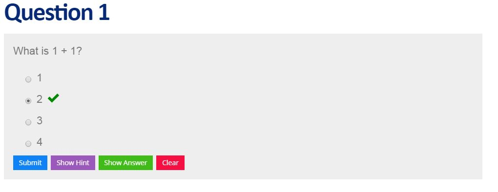

# Slidify


## What Is `slidify`?

- `slidify` was created by Ramnath Vaidyanathan (https://github.com/ramnathv) in order to streamline the process of creating and publishing R driven presentations
- `slidify` is an amalgamation of other technologies including `knitr`, Markdown, and several javascript libraries for HTML5 presentations
- `slidify` is infinitely extendable and customizable, yet it is easy to use!
- `slidify` allows embedded code chunks and mathematical formulas which keeps your presentation reproducible
- `slidify` presentations are just HTML files, so you can view them with any web browser and share them easily on Github, Dropbox, or your own website

---

## Getting `slidify`

- Fire up RStudio!
- First, make sure you have `devtools` installed and loaded


```r
install.packages("devtools")
```

- Second, install `slidify`


```r
pkgs <- c('ramnathv/slidifyLibraries','ramnathv/slidify')
devtools::install_github(pkgs)
```

- Third, load `slidify`


```r
library(slidify)
```

---

## Getting Started with `slidify`

- Set the working directory to where you want to create your `slidify` project


```r
setwd('~/sample/project/')
```

- Create your project and give your project a name (My project is named _"first_deck"_)


```r
author("first_deck")
```

---

## Getting Started with `slidify`

- `author("first_deck")` causes the following to happen:

1. A directory with the name of your project is created inside of your current directory
2. Inside of this directory an `assets` directory and a file called `index.Rmd` is created
3. The `assets` directory is populated with the following empty folders: `css`, `img`, `js`, and `layouts`
4. The newly created `index.Rmd` R Markdown file will open up in R Studio
    - Any custom css, images, or javascript you want to use should respectively be put into the newly created `css`, `img`, and `js` folders
    
---

## Getting to Know `index.Rmd`: `YAML`

- `index.Rmd` is the R Markdown document which you will use to compose the content of your presentation
- The first part of an `index.Rmd` file is a bit of `YAML` code which will look like this

```
---
title       :
subtitle    :
author      :
job         :
framework   : io2012        # {io2012, html5slides, shower, dzslides, ...}
highlighter : highlight.js  # {highlight.js, prettify, highlight}
hitheme     : tomorrow      #
widgets     : []            # {mathjax, quiz, bootstrap}
mode        : selfcontained # {standalone, draft}
---
```

---

## Getting to Know `index.Rmd` : `YAML`

- You can edit your `YAML` to include the title, subtitle, author, and job of the author, including what slide framework you wish to use, which code highlighter you wish to use, and any widgets you want to include
- Other fields you can include in your `YAML`:
    - A logo to appear in your title slide under `logo`
    - The path to your assets folder and the paths to any other folders you may be using under `url`
    - The specific theme for your code highlighter of choice unter `hitheme`
    
```
logo        : my_logo.png
url         :
    assets: ../assets
highlighter : highlight.js  # {highlight.js, prettify, highlight}
hitheme     : zenburn       #
```

- Remember that `../` signifies the parent directory

---

## Getting to Know `index.Rmd` : `YAML`

- The `YAML` for the presentation you're currently viewing looks like this:

```
---
title       : Slidify
subtitle    : Data meets presentation
author      : Jeffrey Leek, Assistant Professor of Biostatistics
job         : Johns Hopkins Bloomberg School of Public Health
logo        : bloomberg_shield.png
framework   : io2012        # {io2012, html5slides, shower, dzslides, ...}
highlighter : highlight.js  # {highlight.js, prettify, highlight}
hitheme     : tomorrow      #
url:
    lib: ../../libraries
    assets: ../../assets
widgets     : [mathjax]     # {mathjax, quiz, bootstrap}
mode        : selfcontained # {standalone, draft}
---
```

---

## Getting to Know `index.Rmd` : Making Slides

Your first two slides are made for you under the `YAML`:

```
## Read-And_Delete

1. Edit YAML front matter
2. Write using R Markdown
3. Use an empty line followed by three dashes to separate slides!

- - - .class #id

## Slide 2
```

- Whatever you put after `##` will be the title of the slide
- `---` marks the end of the slide
- `.class #id` are `CSS` attributes you can use to customize the slide
- Whatever you put between the `##` and the `---` is up to you! As long as it is valid R Markdown or HTML

---

## Getting to Know `index.Rmd` : Making Slides

- To compile your presentation make sure the working directory contains your `index.Rmd` file and enter the following command


```r
slidify('index.Rmd')
```

- An HTML file should appear in your current directory, open it with your favorite web browser and enjoy your `slidify` deck!


```r
browseURL('index.html')
```

---

## Publishing to Github

- First, log into Github and [Create](https://help.github.com/articles/creating-a-new-repository/) a new empty repository
- Use the following command, but replace `user` with your username and `repo` with the name of your new repository (both arguments are strings)


```r
publish_github(user, repo)
```

---

## `HTML5` Deck Frameworks

The following framesorks are compatible with `slidify` for making your presentations:

- [io2012](https://code.google.com/p/io-2012-slides/)
- [html5slides](https://code.google.com/p/html5slides/)
- [deck.js](http://imakewebthings.com/deck.js/)
- [dzslides](http://paulrouget.com/dzslides/)
- [landslide](https://github.com/adamzap/landslide)
- [Slidy](http://www.w3.org/Talks/Tools/Slidy2/Overview.html#(1))

---

## `mathjax`

- You can include $L^AT_EX$ math formatting as follows
- Edit your `YAML`: `widgets : [mathjax]`
- Enter inline math code with `$x^2$` $x^2$
- Enter centered code with `$$\frac{-b \pm \sqrt{b^2 - 4 a c}}{2a}$$`

$$\frac{-b \pm \sqrt{b^2 - 4 a c}}{2a}$$

---

## HTML
- just include HTML in the Rmd file and it will get kept as html when it's slidified
- Especially useful for stuff like images or tables where you need finer control of the html options
- Also, remember you can edit the final html slide
    - This isn't the best solution (since why do mostly slidify, a reproducible format, if you're going to break that reproducibility at the last step?)
    - But, sometimes useful in a pinch (like if you're frantically preparing course slides at the last minute)
- Similarly, you can incorporate JS, or anything else you can do in a web page

---

## Adding Interactive Elements to `slidify`

- You can add interactive elements to `slidify`
    - Quiz question
    - Interactive `rCharts` plots
    - `shiny` apps
- Of course, you could do this directly with html/js
- More easily, the dev version of `slidify` has this built in
- See [http://slidify.github.io/dcmeetup/demos/interactive/](http://slidify.github.io/dcmeetup/demos/interactive/)
    - The following example was taken from there
    
---
    
## Rmd Syntax

```
## Question 1

What is 1 + 1?

1. 1
2. _2_
3. 3
4. 4

*** .hint This is a hint

*** .explanation This is an explanation
```

---


