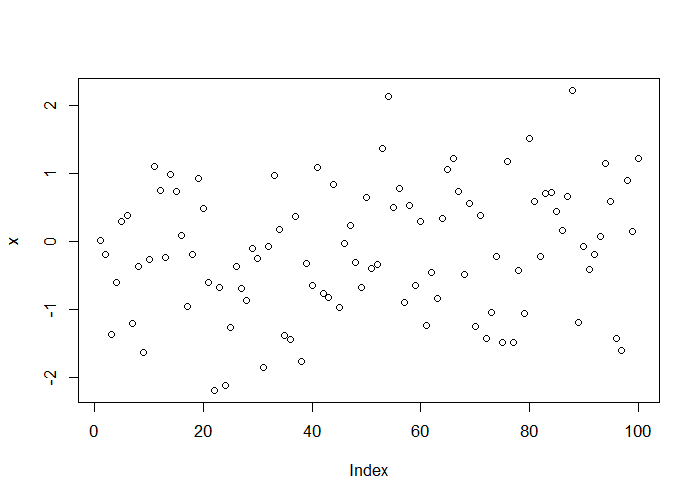
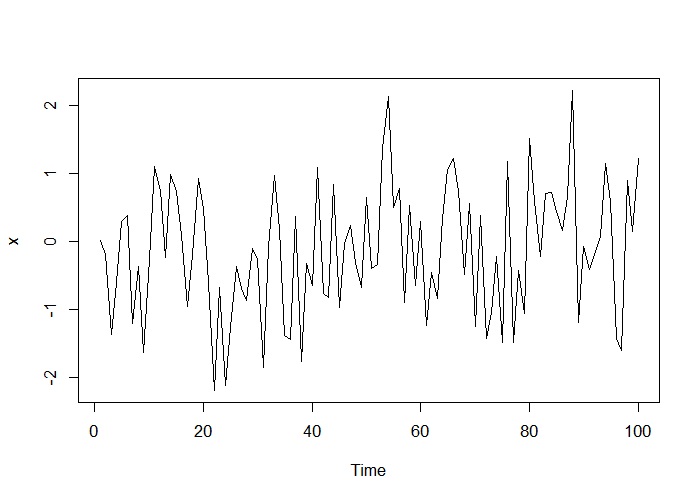
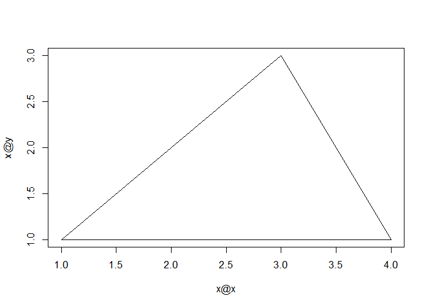

# R Classes and Methods


## Classes and Methods

- A system for doing object oriented programming
- `R` was originally quite interesting because it is both interactive _and_ has a system for object orientation
    - Other languages which support OOP (C++, Java, Lisp, Python, Perl) generally speaking are not interactive languages
- In `R` much of the code for supporting classes/methods is written by John Chambers himself (the creator of the original `S` language) and documented in the book _Programming with Data: A Guide to the S Language_
- A natural extension of Chambers' idea of allowing to cross the user/programmer spectrum
- Object oriented programming is a bit different in `R` than it is in most languages -- even if you are familiar with the idea, you may want to pay attention to the details

---

## Two Styles of Classes and Methods

`S3` classes/methods

- Included with verison 3 of the `S` language
- Informal, a little kludgey
- Sometimes called _old-style_ classes/methods

`S4` classes/methods

- More formal and rigorous
- Included with S-PLUS 6 and R 1.4.0 (December 2001)
- Also called _new-style_ classes/methods

---

## Two worlds living side-by-side

- For now (and the foreseeable future), `S3` classes/methods and `S4` classes/methods are separate systems (but they can be mixed to some degree)
- Each system can be used fairly independently of the other
- Developers of new projects (you!) are encouraged to use the `S4` style classes/methods
    - Used extensively in the Bioconductor project
- But many developers still use `S3` classes/methods ebcause they are "quick and dirty" (and easier)
- In this lecture we will focus primarily on `S4` classes/methods
- The code for implementing S4 classes/methods in `R` is in the `methods` package, which is usually loaded by default (but you can load it with `library(methods)` if for some reason it is not loaded)

---

## Object Oriented Programming in `R`

- A _class_ is a description of a thing. A class can be defined using `setClass()` in the `methods` package
- An _object_ is an instance of a _class_. Objects can be created using `new()`
- A _method_ is a function that only operates on a certain _class_ of _objects_
- A _generic function_ is an `R` function which dispatches _methods_. A _generic function_ typically encapsulates a "generic" concept (e.g. `plot`, `mean`, `predict`, ...)
    - The _generic function_ does not actually do any computation
- A _method_ is the implementation of a _generic function_ for an _object_ of a particular _class_

---

## Things to Look Up

- The help files for the `methods` package are extensive -- do read them as they are the primary documentation
- You may want to start with `?Classes` and `?Methods`
- Check out `?setClass`, `?setMethod`, and `?setGeneric`
- Some of it gets technical, but try your best for now -- it will make sense in the future as you keep using it
- Most of the documentation in the `methods` package is oriented towards developers/programmers as these are the primary people using classes/methods

---

## Classes

All _objects_ in `R` have a _class_ which can be determined by the `class()` function


```r
class(1)
```

```
[1] "numeric"
```

```r
class(TRUE)
```

```
[1] "logical"
```

```r
class(rnorm(100))
```

```
[1] "numeric"
```

```r
class(NA)
```

```
[1] "logical"
```

```r
class("foo")
```

```
[1] "character"
```

---

## Classes (cont'd)

Data _classes_ go beyond the atomic _classes_


```r
x <- rnorm(100)
y <- x + rnorm(100)
fit <- lm(y ~ x)
class(fit)
```

```
[1] "lm"
```

---

## Generics/Methods in `R`

- `S4` and `S3` style generic functions look different but conceptually, they are the same (they play the same role)
- When you program you can write new _methods_ for an existing _generic_ OR create your own _generics_ and associated _methods_
- Of course, if a data type does not exist in `R` that matches your needs, you can always define a new _class_ along with _generics_/_methods_ that go with it

---

## An `S3` Generic Function (in the `base` package)

The `mean` and `print` functions are generic


```r
mean
```

```
function (x, ...) 
UseMethod("mean")
<bytecode: 0x00000000086c0b70>
<environment: namespace:base>
```

```r
print
```

```
function (x, ...) 
UseMethod("print")
<bytecode: 0x00000000081612d8>
<environment: namespace:base>
```

---

## `S3` Methods

The `mean` _generic_ function has a number of _methods_ associated with it


```r
methods("mean")
```

```
[1] mean.Date     mean.default  mean.difftime mean.POSIXct  mean.POSIXlt 
```

---

## An `S4` Generic Function

The `show` _function_ is from the `methods`package and is the `S4` equivalent of `print`


```r
show
```

```
standardGeneric for "show" defined from package "methods"

function (object) 
standardGeneric("show")
<bytecode: 0x0000000008809bc0>
<environment: 0x000000000823eee0>
Methods may be defined for arguments: object
Use  showMethods("show")  for currently available ones.
(This generic function excludes non-simple inheritance; see ?setIs)
```

The `show` _function_ is usually not called directly (much like `print`) because _objects_ are auto-printed

---

## `S4` Methods


```r
showMethods("show")
```

```
Function: show (package methods)
object="ANY"
object="classGeneratorFunction"
object="classRepresentation"
object="envRefClass"
object="function"
    (inherited from: object="ANY")
object="genericFunction"
object="genericFunctionWithTrace"
object="MethodDefinition"
object="MethodDefinitionWithTrace"
object="MethodSelectionReport"
object="MethodWithNext"
object="MethodWithNextWithTrace"
object="namedList"
object="ObjectsWithPackage"
object="oldClass"
object="refClassRepresentation"
object="refMethodDef"
object="refObjectGenerator"
object="signature"
object="sourceEnvironment"
object="standardGeneric"
    (inherited from: object="genericFunction")
object="traceable"
```

---

## Generic/Method Mechanism

The first argument of a _generic function_ is an _object_ of a particular _class_ (there may be other arguments)

1. The _generic function_ checks the _class_ of the _object_
2. A search is done to see if there is an appropriate _method_ for that _class
3. If there exists a _method_ for that _class_, then that _method_ is called on the _object_ and we're done
4. If a _method_ for that _class_ doesn't exist, a search is done to see if there is a default _method_ for the _generic_
5. If a default exists, then the default _method_ is called
6. If a default method doesn't exist, then an error is thrown

---

## Examining Code for Methods

- You cannot just print the code for a _method_ like other _functions_ because the code for the _method_ is usually hidden
- If you want to see the code for an `S3` _method_, you can use the _function_ `getS3method()`
- The call is `getS3method(<generic>, <class>)`
- For `S4` _methods_ you can use the _function_ `getMethod()`
- The call is `getMethod(<generic>, <signature>)` (more details later)

---

## `S3` Class/Method: Example `

What's happening here?


```r
set.seed(2)
x <- rnorm(100)
mean(x)
```

```
[1] -0.03069816
```

1. The _class_ of `x` is _numeric_
2. But there is no `mean` method for numeric objects
3. So we call the default function for `mean`

---

## S3 Class/Method: Example 1


```r
head(getS3method("mean", "default"), 10)
```

```
                                                                      
1  function (x, trim = 0, na.rm = FALSE, ...)                         
2  {                                                                  
3      if (!is.numeric(x) && !is.complex(x) && !is.logical(x)) {      
4          warning("argument is not numeric or logical: returning NA")
5          return(NA_real_)                                           
6      }                                                              
7      if (na.rm)                                                     
8          x <- x[!is.na(x)]                                          
9      if (!is.numeric(trim) || length(trim) != 1L)                   
10         stop("'trim' must be numeric of length one")               
```

---

## S3 Class/Method: Example 1


```r
tail(getS3method("mean", "default"), 10)
```

```
                                                               
15         if (anyNA(x))                                       
16             return(NA_real_)                                
17         if (trim >= 0.5)                                    
18             return(stats::median(x, na.rm = FALSE))         
19         lo <- floor(n * trim) + 1                           
20         hi <- n + 1 - lo                                    
21         x <- sort.int(x, partial = unique(c(lo, hi)))[lo:hi]
22     }                                                       
23     .Internal(mean(x))                                      
24 }                                                           
```

---

## S3 Class/Method: Example 2

What happens here?


```r
set.seed(3)
df <- data.frame(x=rnorm(100), y=1:100)
sapply(df, mean)
```

```
          x           y 
 0.01103557 50.50000000 
```

1. The class of `df` is "data.frame"; each column can be an object of a different class
2. We `sapply` over the columns and call the `mean` function
3. In each column, `mean` checks the class of the objects and dispatches the appropriate method
4. We have a `numeric` column and an `integer` column; `mean` calls the default method for both

---

## Calling Methods Directly

- Some S3 methods are visible to the user (i.e. `mean.default`)
- **Never** call methods directly
- Use the generic function and let the method be dispatched automatically
- With S4 methods you cannot call them directly at all

---

## S3 Class/Method: Example 3

The `plot` function is generic and its behavior depends on the object being plotted


```r
set.seed(10)
x <- rnorm(100)
plot(x)
```

<div class="rimage center"></div>

---

## S3 Class/Method: Example 3

For time series objects, `plot` connects the dots


```r
set.seed(10)
x <- rnorm(100)
x <- as.ts(x)
plot(x)
```

<div class="rimage center"></div>

---

## Write Your Own Methods!

If you write new methods for new classes, you'll probably end up writing methods for the following generics

- `print`/`show`
- `summary`
- `plot`

There are two ways that you can extend the R system via classes/methods

- Write a method for a new class but for an existing generic function (i.e. like `print`)
- Write new generic functions and new methods for those generics

---

## S4 Classes

Why would you want to create a new class?

- To represent new types of data (e.g. gene expression, space-time, hierarchical, sparce matrices)
- New concepts/ideas that haven't been thought of yet (.g. a fitted point process model, mixed-effects model, a sparse matrix)
- To abstract/hide implementation details from the user I say things are "new" meaning that R does not know about them (not that they are new to the statistical community)

---

## S4 Class/Method: Creating a New Class

A new class can be defined using the `setClass()` function

- At a minimum you need to specify the name of the class
- You can also specify data elements that are called _slots_
- You can then define methods for the class with the `setMethod()` function
    - Information about a class definition can be obtained with the `showClass()` function
    
---

## S4 Class/Method: Polygon Class

Creating new classes/methods is usually not something done at the console; you likely want to save the code in a separate file


```r
library(methods)
setClass("polygon",
    representation(x="numeric",
                   y="numeric"))
```

- The slots for this class are `x` and `y`
- The slots for an S4 object can be accessed with the `@` operator

---

## S4 Class/Method: Polygon Class

A plot method can be created with the `setMethod` function

- For `setMethod` you need to specify a generic function (`plot`) and a _signature_
- A signature is a character vector indicating the class of objects that are accepted by the method
- In this case, the `plot` method will take one type of object, a `polygon` object

---

## S4 Class/Method: Polygon Class

Creating a `plot` method with `setMethod`


```r
setMethod("plot", "polygon",
          function(x, y, ...) {
              plot(x@x, x@y, type="n", ...)
              xp <- c(x@x, x@x[1])
              yp <- c(x@y, x@y[1])
              lines(xp, yp)
          })
```

```
[1] "plot"
```

- Notice that the slots of the polygon (the x- and y-coordinates) are accessed with the `@` operator

---

## S4 Class/Method: Polygon Class

After calling `setMethod` the new `plot` method will be added to the list of methods for `plot`


```r
library(methods)
showMethods("plot")
```

```
Function: plot (package graphics)
x="ANY"
x="polygon"
```

Notice that the signature for class `polygon` is listed. The method for `ANY` is the default method and it is what is called when no other signature matches

---

## S4 Class/Method: Polygon Class


```r
p <- new("polygon", x=c(1, 2, 3, 4), y=c(1, 2, 3, 1))
plot(p)
```

<div class="rimage center"></div>

---

## Summary

- Developing classes and associated methods is a powerful way to extend the functionality of R
- **Classes** define new data types
- **Methods** extend **generic functions** to specify the behavior of generic functions on new classes
- As new data types and concepts are created, classes/methods provide a way for you to develop an intuitive interface to those data/concepts for users

---

## Where to Look, Places to Start

- The best way to learn this stuff is to look at examples
- There are quite a few examples on CRAN which use S4 classes/methods. You can usually tell if they use S4 classes/methods if the **methods** package is listed in the `Depends:` field
- Bioconductor ([http://www.bioconductor.org](http://www.bioconductor.org)) -- a rich resource, even if you know nothing about bioinformatics
- Some packages on CRAN (as far as I know) -- SparseM, gpclib, flexmix, its, lme4, orientlib, filehash
- The stats4 package (comes with R) has a bunch of classes/methods for doing maximum likelihood analysis
